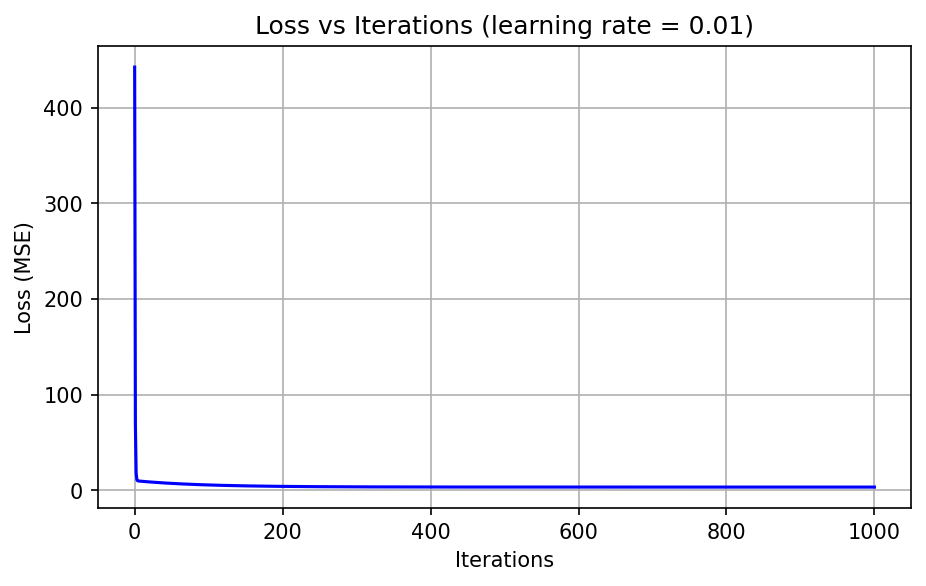
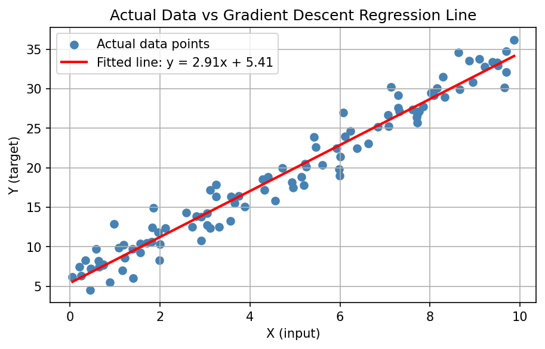
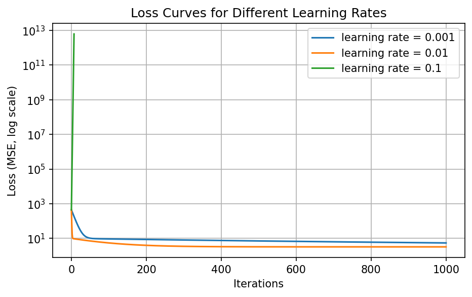

# Gradient Descent Implementation Using Python

**A Mini Project Report**

| | |
|---|---|
| **Student Name** | ____________________ |
| **Roll Number** | ____________________ |
| **Department / Year** | ____________________ / First Year B.E./B.Tech |
| **Subject** | Machine Learning / Python Programming |
| **Guide** | ____________________ |
| **Tools Used** | Python 3, NumPy, Matplotlib (Jupyter Notebook / Google Colab) |

---

## 1. Introduction

### 1.1 What is Gradient Descent?
Imagine you are standing on a foggy hill and want to reach the lowest point in the valley. You cannot see the valley, but you can feel the slope under your feet. So you take a small step downhill, feel the slope again, and repeat. Eventually you reach the bottom.

**Gradient Descent** works the same way. It is an algorithm that adjusts the numbers inside a model, step by step, so that the model's mistakes become smaller and smaller.

### 1.2 Why is optimization important in Machine Learning?
A machine learning model starts with random or zero values and makes poor predictions. *Learning* means finding the parameter values that make predictions as accurate as possible. This search is an **optimization problem**. Without optimization, a model cannot learn from data. Gradient Descent is one of the most widely used optimization methods and is the foundation of how neural networks are trained.

### 1.3 Key Terms

| Term | Simple meaning |
|---|---|
| **Parameters** | The numbers the model learns (here, weight `w` and bias `b`). |
| **Loss function** | A formula that measures how wrong the predictions are (here, Mean Squared Error). |
| **Gradient** | The slope of the loss with respect to a parameter. It tells us which direction increases the loss. |
| **Learning rate (α)** | The size of each step taken downhill. |
| **Iteration** | One complete cycle of: predict → compute loss → compute gradient → update parameters. |

---

## 2. Objectives

1. To understand the working principle of Gradient Descent.
2. To implement Gradient Descent from scratch in Python (no ready-made optimizer).
3. To update model parameters (`w` and `b`) iteratively.
4. To observe how the loss decreases during training.
5. To visualize the training process using Matplotlib.
6. To study the effect of different learning rates.

---

## 3. Dataset

A **synthetic dataset** of 100 points was generated with NumPy:

- `X` = 100 random values between 0 and 10.
- `Y = 3·X + 5 + noise`, where the noise is random (mean 0, standard deviation 2).
- A fixed random seed (`42`) makes the results reproducible.

**Why is it suitable?**
- Linear relationship: a straight line is the correct model, so we can judge whether the algorithm works.
- Known true answer (`w = 3`, `b = 5`): we can compare the learned values against them.
- The noise imitates real data, so a perfect fit (loss = 0) is impossible. The loss should settle near the noise variance (≈ 4).
- It is small, so the program runs in under a second.

The full dataset is used for training (no split), since the aim is to demonstrate the optimizer, not to test generalization.

---

## 4. Mathematical Concept

**Model (prediction):**  `ŷ = w·x + b`

- **Weight (`w`)**: the slope of the line. It controls how strongly `x` affects the prediction.
- **Bias (`b`)**: the intercept. It shifts the line up or down.
- **Prediction (`ŷ`)**: the model's output for a given `x`.

**Loss (Mean Squared Error), for `n` data points:**

`L(w, b) = (1/n) · Σ (ŷᵢ − yᵢ)²`

The error is squared so that positive and negative errors do not cancel and large errors are penalized more.

**Gradients (partial derivatives of the loss):**

`∂L/∂w = (2/n) · Σ (ŷᵢ − yᵢ) · xᵢ`

`∂L/∂b = (2/n) · Σ (ŷᵢ − yᵢ)`

The **gradient** shows the direction in which the loss increases fastest, so we move in the *opposite* direction.

**Parameter update rule (learning rate α):**

`w_new = w_old − α · ∂L/∂w`

`b_new = b_old − α · ∂L/∂b`

### Step-by-step process
1. Start with `w = 0`, `b = 0`.
2. Compute predictions `ŷ = w·x + b`.
3. Compute the loss (MSE).
4. Compute gradients `∂L/∂w` and `∂L/∂b`.
5. Update `w` and `b` using the rule above.
6. Repeat steps 2–5 for many iterations until the loss stops decreasing.

---

## 5. Python Implementation

The complete code is also supplied as `gradient_descent.py` and runs directly in Jupyter or Google Colab. Gradient Descent is coded manually; no Scikit-learn or built-in optimizer is used. (`np.polyfit` appears only once at the end as an independent check.)

```python
import numpy as np
import matplotlib.pyplot as plt

# ---------- 1. CREATE THE DATASET ----------
np.random.seed(42)                       # same random numbers every run
num_samples = 100
X = np.random.uniform(0, 10, num_samples)            # inputs between 0 and 10
true_weight, true_bias = 3.0, 5.0                    # the "hidden" true line
noise = np.random.normal(0, 2, num_samples)          # random noise
Y = true_weight * X + true_bias + noise              # y = 3x + 5 + noise

# ---------- 2. GRADIENT DESCENT FUNCTION ----------
def gradient_descent(X, Y, learning_rate, iterations):
    """Fits y = w*x + b by minimizing Mean Squared Error."""
    n = len(X)
    w, b = 0.0, 0.0                      # initialize parameters
    history = {"w": [], "b": [], "loss": []}

    for i in range(iterations + 1):
        y_pred = w * X + b                           # prediction
        error = y_pred - Y                           # prediction error
        loss = np.mean(error ** 2)                   # MSE loss

        history["w"].append(w)                       # store values (iteration i)
        history["b"].append(b)
        history["loss"].append(loss)

        if i == iterations:                          # stop after recording last state
            break

        dw = (2 / n) * np.sum(error * X)             # gradient wrt w
        db = (2 / n) * np.sum(error)                 # gradient wrt b

        w = w - learning_rate * dw                   # update weight
        b = b - learning_rate * db                   # update bias
        if not np.isfinite(loss) or loss > 1e12:     # stop if it blows up
            history["w"].append(w); history["b"].append(b); history["loss"].append(np.inf)
            break
    return w, b, history

# ---------- 3. MAIN TRAINING RUN (learning rate = 0.01) ----------
learning_rate, iterations = 0.01, 1000
w, b, hist = gradient_descent(X, Y, learning_rate, iterations)

print("Training table (learning rate = 0.01)")
print(f"{'Iteration':>10} {'Weight':>10} {'Bias':>10} {'Loss':>12}")
for it in [0, 100, 200, 500]:
    print(f"{it:>10} {hist['w'][it]:>10.4f} {hist['b'][it]:>10.4f} {hist['loss'][it]:>12.4f}")
print(f"{'Final':>10} {w:>10.4f} {b:>10.4f} {hist['loss'][-1]:>12.4f}")

# ---------- 4. GRAPH 1: LOSS vs ITERATIONS ----------
plt.figure(figsize=(7, 4))
plt.plot(hist["loss"], color="blue")
plt.xlabel("Iterations"); plt.ylabel("Loss (MSE)")
plt.title("Loss vs Iterations (learning rate = 0.01)")
plt.grid(True); plt.show()

# ---------- 5. GRAPH 2: ACTUAL vs PREDICTED ----------
plt.figure(figsize=(7, 4))
plt.scatter(X, Y, color="steelblue", label="Actual data points")
x_line = np.linspace(X.min(), X.max(), 100)
plt.plot(x_line, w * x_line + b, color="red", linewidth=2,
         label=f"Fitted line: y = {w:.2f}x + {b:.2f}")
plt.xlabel("X (input)"); plt.ylabel("Y (target)")
plt.title("Actual Data vs Gradient Descent Regression Line")
plt.legend(); plt.grid(True); plt.show()

# ---------- 6. EXPERIMENT: DIFFERENT LEARNING RATES ----------
rates = [0.001, 0.01, 0.1]
results = {lr: gradient_descent(X, Y, lr, iterations) for lr in rates}

plt.figure(figsize=(7, 4))
for lr in rates:
    plt.plot(results[lr][2]["loss"], label=f"learning rate = {lr}")
plt.yscale("log")
plt.xlabel("Iterations"); plt.ylabel("Loss (MSE, log scale)")
plt.title("Loss Curves for Different Learning Rates")
plt.legend(); plt.grid(True); plt.show()
```
*(The file `gradient_descent.py` also prints the comparison table.)*

---

## 6. Training and Parameter Updates

**Actual output of the program (learning rate = 0.01, 1000 iterations):**

| Iteration | Weight | Bias | Loss |
|---:|---:|---:|---:|
| 0 | 0.0000 | 0.0000 | 442.2545 |
| 100 | 3.3371 | 2.6389 | 5.4382 |
| 200 | 3.1540 | 3.8297 | 3.9535 |
| 500 | 2.9544 | 5.1285 | 3.2522 |
| Final (1000) | 2.9109 | 5.4115 | 3.2264 |

**Observations**
- The loss falls from **442.25 to 3.23**, a reduction of more than 99%.
- The weight starts at 0, overshoots slightly (3.34 at iteration 100), then settles near 2.91.
- The bias rises from 0 to about 5.41. It converges more slowly than the weight, because the gradient for `b` is smaller.
- Final values (`w ≈ 2.91`, `b ≈ 5.41`) are close to the true values (3 and 5). The difference is caused by noise, not by an error in the algorithm.

---

## 7. Visualization

**Graph 1: Loss vs Iterations**



The loss drops steeply in the first ~50 iterations and then flattens, which indicates convergence.

**Graph 2: Actual vs Predicted Values**



The red line passes through the middle of the scattered data points, showing a good fit.

---

## 8. Analysis

**Why does the loss decrease?** Each update moves `w` and `b` opposite to the gradient, i.e., in the direction in which the loss decreases fastest. With a suitable step size, every step lowers the loss.

**How are weight and bias updated?** Using `w = w − α·(∂L/∂w)` and `b = b − α·(∂L/∂b)`. When the gradient is large (far from the minimum), the step is large; as it approaches the minimum, the gradient shrinks and the steps become smaller.

**Effect of the learning rate.** It controls the step size and therefore both the speed and the stability of training.

**Learning rate too small.** Steps are tiny, so training is slow. In our experiment, α = 0.001 had loss 5.44 after 1000 iterations, while α = 0.01 reached 3.23. The small rate had not yet finished converging (weight 3.34, bias 2.64, still far from the final values).

**Learning rate too large.** Steps overshoot the minimum, and the loss can grow instead of shrink, a situation called **divergence**. In our experiment, α = 0.1 diverged (see Section 9).

**Why multiple iterations?** One step only moves the parameters a short distance. Many small steps are needed to reach the minimum.

**What happens at convergence?** The gradient becomes almost zero, the parameters stop changing noticeably, and the loss stays almost constant. Here the loss settles near 3.2, which is close to the noise variance (σ² = 4) in the data. It cannot reach 0 because of the noise.

---

## 9. Experiment: Comparing Learning Rates

Gradient Descent was run for 1000 iterations with three learning rates (same data, same starting point).

| Learning rate | Iterations run | Final loss | Final weight | Final bias | Convergence behavior |
|---:|---:|---:|---:|---:|---|
| 0.001 | 1000 | 5.4444 | 3.3377 | 2.6350 | Stable but slow; not fully converged (bias still far from final value) |
| 0.01 | 1000 | 3.2264 | 2.9109 | 5.4115 | Fast and stable; converged near the best values |
| 0.1 | 8 (stopped) | Diverged (∞) | −2,339,784.8 | −359,619.1 | Diverged; loss exploded |

**Loss at selected iterations:**

| Learning rate | Iter 0 | Iter 10 | Iter 100 | Iter 500 | Iter 1000 |
|---:|---:|---:|---:|---:|---:|
| 0.001 | 442.26 | 127.07 | 9.25 | 7.09 | 5.44 |
| 0.01 | 442.26 | 9.25 | 5.44 | 3.25 | 3.23 |
| 0.1 | 442.26 | diverged | — | — | — |

For α = 0.1 the loss values at iterations 0–7 were 442, 1.22×10⁴, 3.46×10⁵, 9.78×10⁶, 2.77×10⁸, 7.82×10⁹, 2.21×10¹¹, 6.26×10¹². Each step increased the loss by about 28 times. The program stopped once the loss exceeded 10¹².

**Comparison graph**


*(Log scale on the y-axis. The α = 0.1 curve rises steeply and ends after a few iterations.)*

**Explanation.**
- **α = 0.001** descends smoothly but slowly.
- **α = 0.01** is the best choice here: quick and stable.
- **α = 0.1** is too large for this problem. Because the inputs `X` go up to 10, the gradient with respect to `w` is large, so each step overshoots the minimum by more than it corrects.

> **Note:** Many textbooks show 0.1 as a good learning rate, but a good value depends on the data. If `X` is scaled first (feature scaling or normalization), larger learning rates become safe. This is why feature scaling is a standard step in practice.

**Verification.** NumPy's `np.polyfit` (used only as a check) gives the exact least-squares solution `w = 2.9080`, `b = 5.4302`. Our α = 0.01 result (`w = 2.9109`, `b = 5.4115`) is very close, confirming that the implementation is correct.

---

## 10. Result

Starting from `w = 0`, `b = 0` (loss = 442.25), Gradient Descent with α = 0.01 and 1000 iterations found:

- **Weight = 2.9109**
- **Bias = 5.4115**
- **Final loss (MSE) = 3.2264**

These are close to the true line `y = 3x + 5` and to the exact least-squares solution (2.9080, 5.4302). The loss fell by more than 99% and flattened out, which shows convergence. The experiment also showed that the learning rate strongly affects the outcome: 0.001 was too slow, 0.01 was suitable, and 0.1 diverged.

---

## 11. Conclusion

In this project, Gradient Descent was implemented from scratch using only NumPy and Matplotlib. We learned that:

- Learning in ML is the process of minimizing a loss function.
- The gradient gives the direction in which to adjust parameters, and the learning rate decides the step size.
- Repeating small updates reduces the loss until the algorithm converges.
- Choosing the learning rate is critical: too small wastes time, too large causes divergence.
- Writing the algorithm by hand gives a clear understanding of what happens inside ML libraries.

**Future scope:** multiple features, feature scaling, stochastic/mini-batch Gradient Descent, momentum and Adam optimizers.

---

## 12. Viva Questions and Answers

**1. What is Gradient Descent?**
An iterative optimization algorithm that adjusts model parameters in the direction opposite to the gradient of the loss, to minimize the loss.

**2. What is a learning rate?**
A small positive number that controls how big each update step is.

**3. What is a gradient?**
The slope (partial derivative) of the loss with respect to a parameter. It tells how the loss changes when the parameter changes.

**4. What is a loss function?**
A function that measures how far the predictions are from the actual values. Lower loss means better predictions.

**5. Why do we update parameters?**
Initial parameters give poor predictions. Updating them step by step reduces the loss and improves the model.

**6. What is convergence?**
The stage where the loss stops decreasing significantly and the parameters stop changing, meaning the algorithm has reached (or is very near) a minimum.

**7. What happens with a very large learning rate?**
The updates overshoot the minimum, the loss may oscillate or increase, and the algorithm can diverge. In our experiment α = 0.1 diverged.

**8. What happens with a very small learning rate?**
The loss decreases very slowly and needs many iterations. With α = 0.001 the loss was still 5.44 after 1000 iterations.

**9. Why is MSE used?**
It is always non-negative, penalizes large errors more, and is smooth and differentiable, which makes gradients easy to compute. For linear regression it has a single minimum.

**10. How is Gradient Descent used in Machine Learning?**
It is used to train models such as linear regression, logistic regression, and neural networks by minimizing their loss. Deep learning optimizers (SGD, Adam) are improved versions of it.

---

## References
1. Andrew Ng, *Machine Learning* course notes (Stanford / Coursera).
2. I. Goodfellow, Y. Bengio, A. Courville, *Deep Learning*, MIT Press, 2016, Chapter 4 and 8.
3. NumPy documentation: https://numpy.org/doc/
4. Matplotlib documentation: https://matplotlib.org/stable/
